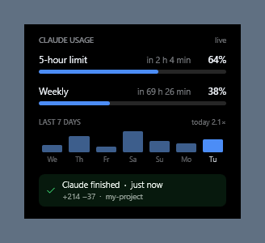

# Claude Usage Widget

A transparent desktop widget for Windows that shows how much of your
**Claude subscription's 5-hour and weekly rate limits** you have used — plus a
7-day history, a burn-rate warning, and optional threshold alerts.

It reads the numbers from Claude Code's own status line. **No API calls, no
tokens, no quota spent to measure quota.**

*[Türkçe belgeler: README.tr.md](README.tr.md)*



## How it works

Claude Code passes session data to your configured `statusLine` script on
stdin, and that JSON contains the rate-limit fields:

```json
"rate_limits": {
  "five_hour": { "used_percentage": 23.5, "resets_at": 1738425600 },
  "seven_day": { "used_percentage": 41.2, "resets_at": 1738857600 }
}
```

```
Claude Code ──stdin JSON──▶ durum-yaz.js ──▶ %APPDATA%\ClaudeKullanim\durum.json
                                 │                          │
                                 ▼                          ▼
                          status line in your          kullanim.ps1
                          terminal                     (the widget)
```

The same install also registers `Stop` and `Notification` hooks, so the widget
can tell you when Claude finished a long job or is waiting for permission.

## Features

- **5-hour and weekly usage bars** with reset countdowns
- **Burn-rate projection** — bars turn red when the window will run out *before*
  it resets, even at moderate usage. A window at 60% that lost 30 points in the
  last 20 minutes is more dangerous than one sitting quietly at 85%.
- **7-day history** — daily consumption measured in "5-hour windows"
  (100 points = one full window, so `today 2.1×` means about two windows today)
- **Threshold alerts** — optional pop-up when a limit crosses a percentage you
  pick; fires once per window and re-arms when the window resets
- **Event line** — "Claude finished · +214 −37 · my-project" or
  "waiting for permission", driven by hooks
- **Honest about stale data** — dims and states *why* the numbers stopped
  updating instead of silently showing an old percentage
- **Enriched terminal status line** — model, reasoning effort, fast mode,
  active agent, output style, context %, limits, clickable PR link, and a
  version badge when your Claude Code is out of date

## Requirements

- Windows 10 or 11
- Windows PowerShell 5.1 (preinstalled)
- [Node.js](https://nodejs.org) — the status line and hook scripts run on it
  (chosen for start-up speed: ~136 ms versus ~399 ms for PowerShell, and this
  script runs often)
- Claude Code, signed in with a Claude.ai **Pro or Max** subscription
  (`rate_limits` is only sent to subscription accounts)

## Install

```powershell
git clone https://github.com/sefaguntepe/claude-usage-widget.git
cd claude-usage-widget
node statusline.js kur
powershell -ExecutionPolicy Bypass -File kur-baslangic.ps1
```

- `node statusline.js kur` registers the status line and the two hooks in
  `~/.claude/settings.json`. It **backs the file up first**, refuses to touch a
  status line that is not ours, and preserves other people's hook entries.
- `kur-baslangic.ps1` adds a Startup shortcut so the widget launches at sign-in.

Check the current state any time with `node statusline.js durum`.

## Important limitation — read this first

**The numbers only refresh in a terminal Claude Code session.** The desktop app
does not run status line scripts, so if you work only there, the percentages
freeze. The widget detects this and says so after 12 hours instead of leaving
you with a stale number.

There is no workaround: no local file holds this data, and the hook payload
does not include rate limits. The only alternative would be calling the API
with your OAuth token — which spends quota to measure quota and is a grey area
under the terms of service. Deliberately not done.

Two further limits:

- Only `five_hour` and `seven_day` are available. The per-model weekly window
  that `/usage` shows has no local source.
- `rate_limits` arrives only after the session's first API response, so a brand
  new session briefly shows the previous value. The script never overwrites
  good data with empty data.

## Configuration

Right-click the widget:

| Menu | What it does |
|---|---|
| *Background* | Transparent / light / dark backdrop |
| *Alert threshold* | Per-window alert level — off, or 50–95% |
| *Reset position* | Move back to the top-right corner |
| *Close* | Quit |

Alerts are **off by default**. When one fires it stays until clicked, never
steals focus, and will not fire again for the same window even if usage keeps
climbing — the reset boundary is what re-arms it, not a timer.

Settings and data live in `%APPDATA%\ClaudeKullanim`.

## Uninstall

```powershell
node statusline.js kaldir
powershell -ExecutionPolicy Bypass -File kaldir-baslangic.ps1
```

The first command removes the status line and hooks (backing up
`settings.json` again). Then close the widget from its right-click menu and
delete `%APPDATA%\ClaudeKullanim` if you want the history gone too.

## Notes

- **Interface language follows Windows.** Turkish on a Turkish display language,
  English otherwise — no setting, no restart dance. Only `tr` and `en` are
  built in; adding another is a string table away.
- Because the widget never takes keyboard focus (so it can sit on the desktop
  without interrupting you), values are chosen from menus rather than typed.
- The `Stop` hook is handled carefully: returning exit code 2 from it would
  make Claude keep going instead of stopping, so `olay-yaz.js` wraps everything
  in try/catch and always exits 0. Preserve that if you modify it.

## License

MIT — see [LICENSE](LICENSE).
