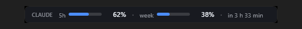

*[English documentation: README.md](README.md)*

# Claude Kullanım — masaüstü limit widget'ı

Claude aboneliğinin 5 saatlik ve haftalık limit doluluğunu masaüstünde, şeffaf
bir pencerede gösterir. Ağa çıkmaz, token okumaz, kota harcamaz.

```
CLAUDE KULLANIM                        canlı
5 saatlik limit     3 sa 44 dk sonra    56%
▓▓▓▓▓▓▓▓▓▓▓▓▓▓░░░░░░░░░░░░░░
Haftalık               35 dk sonra      74%
▓▓▓▓▓▓▓▓▓▓▓▓▓▓▓▓▓▓░░░░░░░░░░
```

## Nasıl çalışıyor

Claude Code, `statusLine` olarak tanımlanan betiğe oturum verisini stdin'den
JSON olarak geçer ve bu JSON'da limit bilgisi vardır:

```json
"rate_limits": {
  "five_hour": { "used_percentage": 23.5, "resets_at": 1738425600 },
  "seven_day": { "used_percentage": 41.2, "resets_at": 1738857600 }
}
```

```
Claude Code ──stdin JSON──▶ durum-yaz.js ──▶ %APPDATA%\ClaudeKullanim\durum.json
                                 │                          │
                                 ▼                          ▼
                        terminaldeki durum satırı      kullanim.ps1 (widget)
```

Alternatifler neden elenmiş, "Denenen yollar" başlığında.

### Betik ne zaman çalışır

**Render'a değil, olaya bağlı.** Claude Code betiği şu anlarda çalıştırır:

- Oturum başlarken (resume dahil)
- **Yeni bir asistan mesajı geldiğinde** ← ana tetikleyici
- `/compact` bitince, izin modu veya vim modu değişince
- `statusLine` komutu değişince
- Bir limit penceresi `resets_at` anına ulaşınca (sıfırlanma anında otomatik)
- **`refreshInterval` zamanlayıcısı dolunca — bizde 30 saniye**

Güncellemeler 300 ms geciktirmeli (debounce) toplanır; betik hâlâ çalışırken
yeni tetik gelirse önceki çalışma iptal edilir.

> **`refreshInterval` neden var:** olay tetikleyicileri, tek bir uzun araç
> çağrısı veya arka plan alt ajanı beklenirken sessizleşir; o sürede yüzdeler
> donar. 30 sn'lik zamanlayıcı bunu kapatır. 30 seçildi çünkü geçmiş
> örnekleme 60 sn'de bir yazıyor — yenileme de 60 sn olsaydı zamanlama
> kayması yüzünden örnekler atlanabilirdi.

## Dosyalar

| Dosya | Görevi |
|---|---|
| `durum-yaz.js` | statusLine betiği: durum.json'u yazar + terminal satırını basar |
| `olay-yaz.js` | `Stop` / `Notification` hook betiği: olay.json'u yazar |
| `statusline.js` | `settings.json`'daki statusLine **ve hook** ayarlarını kurar/kaldırır (yedekleyerek) |
| `kullanim.ps1` | Widget penceresi |
| `kur-baslangic.ps1` / `kaldir-baslangic.ps1` | Windows açılışına ekle/çıkar |

## Terminal satırı

```
! Opus·high fast think · @my-agent · learning · v2.1.230 var · proje · #42 · ctx 8% · 5sa 85% · ~40 dk
```

- `·high` efor, `fast` fast mode, `think` extended thinking — kotayı neyin
  yaktığını gösterir.
- `@ajan` aktif ajan (`--agent` ile çalışırken), `learning` output style
  (yalnızca `default` dışındaysa).
- `v2.1.230 var` kurulu sürüm eskiyse. Otomatik güncelleme başarısız olduysa
  kırmızı "guncelleme basarisiz". Sorgu 6 saatte bir, **kopuk bir süreçte** —
  satır asla ağ beklemez.
- `~40 dk` tüketim hızı tahmini; **yalnızca limit sıfırlanmadan önce bitecekse**.
- Bir limit %90'ı geçerse başa kalın kırmızı `!` gelir, yüzde kırmızıya döner.
- `#42` açık PR; OSC 8 destekleyen terminalde (Windows Terminal) tıklanabilir.
- Terminal darsa `COLUMNS`'a göre kırpılır: önce oturum adı, sonra PR, dizin,
  ctx atılır. Limitler ve model en son gider. **Görüntü sırası hiç değişmez.**

## Tüketim hızı ve haftalık geçmiş

`gecmis.json` 60 saniyede bir örnek alır (son 300 örnek + son 30 günün
toplamı). Buradan iki şey çıkar:

**Hız** — son 45 dakikanın %/dakika eğimi, kalan yüzdeye bölünerek "ne kadarda
biter" tahmini. Bar rengi de buna duyarlı: pencere sıfırlanmadan bitecek gibiyse
doluluk düşük olsa bile kırmızı yanar. *%60 dolu ama son 20 dakikada %30 yenmiş*
durumu, %85'te sakin sakin ilerlemekten daha tehlikelidir.

> Örnek aralığında bir sıfırlanma varsa hız **hiç** hesaplanmaz — düşen değerle
> eğim almak saçma sonuç verir.

**Son 7 gün** — her günün tüketimi çubuk olarak. Ölçü birimi "5 saatlik
pencere": 100 puan = bir tam pencere, yani `bugün 1,1×` bir buçuğa yakın
pencere tükettiğiniz anlamına gelir. Günlük toplam, pencerenin *artışları*
toplanarak bulunur; sıfırlandığında yeni değerin kendisi eklenir.

## Eşik uyarısı (pop-up)

Limit belirlediğiniz yüzdeyi geçince masaüstünde uyarı çıkar.

**Açmak:** sağ tık → **Uyarı eşiği** → *5 saatlik limit* / *Haftalık* →
Kapalı, %50, %60, %70, %75, %80, %85, %90, %95. **Varsayılan kapalıdır.**

```
⚠ Kullanım uyarısı
5 saatlik limit %86 seviyesine ulaştı (eşik %80).
Sıfırlanma: 8 Eylül 14:47                        [ Tamam ]
```

- **Tıklanana kadar durur.** Topmost ama odak çalmaz — yazı yazarken
  tuşlarınızı kesmez. Birden çok uyarı sağ altta istiflenir.
- **Pencere başına bir kez.** Aynı 5 saatlik pencerede %85 → %95 çıksanız da
  tekrar uyarmaz; pencere sıfırlanınca uyarı hakkı kendiliğinden tazelenir.
  İşaretleme `resets_at` değeriyle yapılır (`pencere.json` → `atesli5`/`atesliH`),
  yani widget yeniden başlasa bile aynı uyarı tekrar çıkmaz.
- **Bayat veride uyarı yok.** 24 saat önceki bir yüzdeyle uyarmak yanıltıcı
  olurdu; veri taze değilse sessiz kalır.
- Eşiği değiştirirseniz "zaten uyarıldı" durumu sıfırlanır.

> Sayı elle yazılamaz, listeden seçilir — widget klavye odağı almıyor. Odak
> alsaydı tıkladığınızda öne fırlar ve masaüstü seviyesinde durma özelliğini
> kaybederdi.

## Olay satırı (hook'lar)

Uzun bir iş verip başka pencereye geçtiğinizde widget haber verir:

| Durum | Görünüm |
|---|---|
| Claude yanıtı bitirdi (`Stop`) | Yeşil ✓ "Claude bitirdi · az önce" + "+2203 −167 · proje" |
| İzin/girdi bekliyor (`Notification`) | Amber ⏳ "İzin bekliyor · az önce" |

İlk 12 saniye yanıp söner, 15 dakika sonra kaybolur. Alt ajan olayları ve
ilgisiz bildirim türleri (`auth_success` vb.) gösterilmez.

> **`Stop` hook'u tehlikelidir:** exit 2 dönerse Claude durmaz, konuşmaya devam
> eder — yani buradaki bir hata sonsuz döngü demektir. `olay-yaz.js`'in tüm
> gövdesi try/catch içinde ve her yol `process.exit(0)` ile biter. Bu dosyayı
> değiştirirseniz bu garantiyi bozmayın.

## Kurulum

```bash
node statusline.js kur
```

```bash
powershell -ExecutionPolicy Bypass -File kur-baslangic.ps1
```

`kur` hem statusLine'ı hem `Stop`/`Notification` hook'larını kurar.
Kaldırmak: `node statusline.js kaldir` ve `kaldir-baslangic.ps1`.
Durumu görmek: `node statusline.js durum`.

`statusline.js` her yazmadan önce `settings.json`'u
`settings.json.yedek-<tarih>` olarak yedekler; size ait olmayan bir statusLine
görürse dokunmadan durur ve başkasına ait hook girişlerini korur (yalnızca
`olay-yaz.js` içerenleri ekler/çıkarır).

## Sınırlar — önce bunları bilin

1. **Yalnızca 2 pencere gösterilebilir.** Claude Code `five_hour` ve
   `seven_day` veriyor; `/usage` ekranındaki model-bazlı üçüncü satır
   ("Weekly · Fable" gibi) hiçbir yerel kaynakta yok.
2. **Yüzdeler yalnızca terminal (CMD) oturumunda ÇALIŞIRKEN ilerler.**
   İki ayrı sebep var:

   1. Masaüstü uygulaması statusLine betiklerini hiç çalıştırmıyor.
   2. `rate_limits` **canlı bir sorgu değil** — o oturumun son API yanıtından
      kalma bir fotoğraf. Claude Code onu önbellekte tutar ve statusline her
      çalıştığında aynı değerleri yeniden gönderir; yani **boşta duran** bir
      oturum dosyayı tazeler ama sayılar kıpırdamaz.

   (2) yüzünden boşta bir oturum açık bırakmak işe yaramaz. Widget, dosyanın
   yazıldığı anı değil değerlerin **ölçüldüğü** anı takip eder: boşta oturumda
   "canlı" değil "12 dk önce" yazar. Bayat barlar griye döner, yaş etiketi
   amber olur.
   *(Masaüstü oturumları için alternatif yerel kaynak yok — limit verisi
   hiçbir dosyaya yazılmıyor.)*
3. **Veri sadece Claude Code açıkken tazelenir.** Oturum kapalıyken widget son
   bilinen değeri soluk gösterir ve yaşını yazar ("20 dk önce"). Sıfırlanma
   geri sayımı yerel hesaplanır, bayat veride bile doğrudur.
4. **`rate_limits` oturumun ilk API yanıtından sonra gelir.** Yeni oturumun ilk
   saniyelerinde eski değer görünür — bu normaldir. `durum-yaz.js`, veri
   yokken dosyaya dokunmaz; iyi veriyi boş veriyle ezmez.
5. **statusLine tanımlamak Claude Code'un alt bilgi ipuçlarını gizler**
   (`esc to interrupt`, `? for shortcuts`). Yerine model, dizin, bağlam ve
   limit yüzdelerini gösteren bir satır gelir.

## Denenen yollar (ve neden elendiler)

| Yol | Sonuç |
|---|---|
| `claude usage` benzeri bir CLI komutu | Yok — alt komut listesinde böyle bir şey bulunmuyor |
| Diskte önbelleklenmiş limit durumu | Yok. `stats-cache.json` yalnızca geçmiş aktivite, `policy-limits.json` alakasız |
| Transkriptlerden token toplayıp tahmin | Planın gerçek tavanı bilinmediği için `/usage` ile tutmaz |
| OAuth token ile API'ye istek | Kesin ama kotayı ölçmek için kota harcar, token yenilemesi ister, otomatik erişim ToS açısından gri alan |
| **statusLine JSON'u** | ✅ Resmî, yerel, bedava, tam olarak aranan alanlar |

## Tuzaklar (aynı hataya düşmemek için)

- **`[Math]::Min(1, $oran)` YAZMAYIN.** Literal `1` Int32 olduğu için PowerShell
  tamsayı aşırı yüklemesini seçer ve `0.56` → `1` yuvarlanır; her bar %100 dolu
  çizilir. Sınırlamayı elle `if` ile yapın.
- **statusLine betiği hızlı olmalı** — sık çalışır (aşağıya bakın). Ölçülen başlangıç süreleri:
  Python 121 ms, **Node 136 ms**, PowerShell **399 ms**. PowerShell terminali
  gözle görülür şekilde sürükler; Node seçildi.
- `.ps1` dosyaları UTF-8 **BOM ile** kaydedilmeli; Windows PowerShell 5.1
  BOM'suz UTF-8'i ANSI sanıp Türkçe karakterleri bozar.
- `HWND_BOTTOM` = **1**, 8 değil.

## Tanı

```bash
set KULLANIM_TANI=1 && powershell -ExecutionPolicy Bypass -STA -File kullanim.ps1
```

Günlük: `%TEMP%\claude-kullanim-tani.log` (bar genişlikleri, ölçek, hizalama).

statusLine betiğini elle denemek:

```bash
echo {"model":{"display_name":"Opus"},"rate_limits":{"five_hour":{"used_percentage":56,"resets_at":1786519202}}} | node durum-yaz.js
```

## Şekillendirilebilir nokta: `Get-BarRengi`

`kullanim.ps1` içindeki bu fonksiyon şu an sadece doluluğa bakıyor — %75 altı
mavi, %75–89 amber, %90+ kırmızı:

```powershell
function Get-BarRengi {
    param([double]$Yuzde, [Nullable[datetime]]$Sifirlanma)
    if ($Yuzde -ge 90) { return '#E5484D' }
    if ($Yuzde -ge 75) { return '#E8A33D' }
    return '#4C8DF6'
}
```

Ama asıl soru "yüzde kaç doldu" değil, **"bu gidişle yetişir mi"**. %80 dolu ama
4 saat sonra sıfırlanacak bir pencere rahat; %60 dolu ama 20 dakikada %30
tüketilmişse durum kötü. Fonksiyon `$Sifirlanma` parametresini zaten alıyor —
şu an kullanmıyor.

**Tüketim hızına bağlamak için:** `durum-yaz.js` her yazışta örneği bir geçmiş
dosyasına ekleyebilir (`{zaman, yuzde}`, son ~20 kayıt yeterli). Widget iki
örnek arasındaki `Δyüzde / Δdakika` ile hızı bulur, kalan yüzdeyi bu hıza bölüp
"bu hızla ~1 sa 10 dk'da biter" tahminini çıkarır ve bu süre sıfırlanmaya kalan
süreden **kısaysa** kırmızıya döner. Böylece renk "ne kadar harcadım"ı değil
"yetişecek mi"yi anlatır.

Daha basit bir ara adım: eşikleri sabit tutup sıfırlanmaya 30 dakikadan az
kalmışsa kırmızıyı hiç göstermemek — nasılsa birazdan sıfırlanacak.

## Görünüm temaları

Sağ tık → **Görünüm** ile iki yerleşim arasında geçiş yapılır:

| | |
|---|---|
| **Kart** | Masaüstünde duran pano. Masaüstü seviyesinde kalır, hiçbir pencerenin önüne geçmez. |
| **Şerit (alt bar)** | Görev çubuğunun üzerine oturan ince tek satır. Her zaman görünür. |



Windows 11'de görev çubuğuna **içerik eklemenin desteklenen bir yolu yok** —
deskband API'si kaldırıldı. Explorer'a müdahale eden üçüncü parti yöntemler hem
sürüm güncellemelerinde kırılıyor hem de kurumsal güvenlik yazılımlarının
engellediği türden. Bu yüzden şerit, çubuğun **üzerine binen** ayrı bir pencere:

- Çalışma alanı dışında kalan bandı (`SystemParameters.WorkArea` ile ekran
  boyutunun farkı) ölçüp tam ortasına yerleşir; çubuk üst kenardaysa oraya gider.
- Sağdan 250 px pay bırakır ki saat/bildirim alanını örtmesin.
- Görev çubuğuna tıklandığında explorer kendini öne alır; şerit `HWND_TOPMOST`'u
  `WM_WINDOWPOSCHANGING` kancasında yeniden yazarak üstte kalır. Yoklama yok —
  eski sürümdeki 2 saniyelik döngü masaüstü sağ tık menüsünü bozmuştu.

İki tema **ayrı konum** tutar (`pencere.json` → `sol/ust` ve `seritSol/seritUst`).
Tek konum paylaşsalardı her geçişte biri kayardı. "Konumu sıfırla" aktif temayı
sıfırlar.

## Arayüz dili

Arayüz **Windows görüntü diline göre** otomatik seçilir: Türkçe sistemde Türkçe,
diğerlerinde İngilizce. Ayar yok. Yalnızca `tr` ve `en` var; yeni bir dil
eklemek metin tablosuna bir satır eklemek demek.
